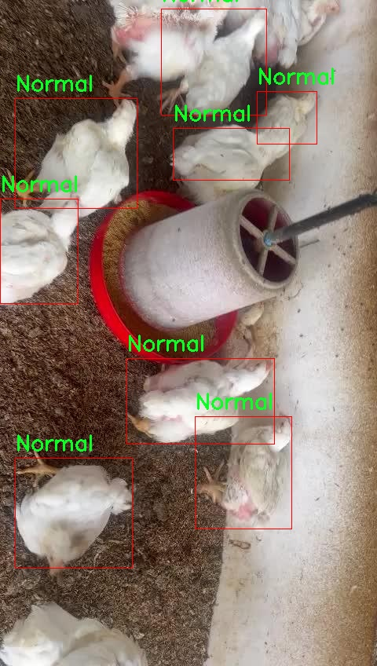

### 1.背景意义

研究背景与意义

随着全球对食品安全和动物福利的关注日益增强，养殖业面临着前所未有的挑战。尤其是在鸡只养殖中，健康状态的监测与管理直接关系到养殖效益和产品质量。传统的健康状态检测方法多依赖人工观察，不仅效率低下，而且容易受到主观因素的影响，导致误判和漏判。因此，开发一种高效、准确的鸡只健康状态检测系统显得尤为重要。

近年来，深度学习技术的快速发展为图像识别和物体检测提供了新的解决方案。YOLO（You Only Look Once）系列算法因其实时性和高精度的特点，已广泛应用于各类物体检测任务。然而，现有的YOLO版本在特定场景下的适应性和准确性仍有待提升。基于此，本研究提出了一种改进的YOLOv11模型，旨在针对养殖场鸡只的健康状态进行有效检测。

本项目所使用的数据集包含两类标签：正常（Normal）和异常（AbNormal），涵盖了鸡只在不同健康状态下的图像。这一数据集的构建为模型的训练和验证提供了坚实的基础，使得系统能够在实际应用中快速识别和分类鸡只的健康状态。通过对数据集的深入分析与模型的优化，我们期望提高检测的准确率，降低误判率，从而为养殖场提供更为可靠的健康监测手段。

综上所述，基于改进YOLOv11的鸡只健康状态检测系统不仅具有重要的学术价值，也为养殖业的智能化管理提供了实践依据。通过该系统的实施，能够有效提升养殖场的管理效率，降低疾病传播风险，最终实现经济效益与动物福利的双重提升。

### 2.视频效果

[2.1 视频效果](https://www.bilibili.com/video/BV1onUGYoEju/)

### 3.图片效果


##### [项目涉及的源码数据来源链接](https://kdocs.cn/l/cszuIiCKVNis)**

注意：本项目提供训练的数据集和训练教程,由于版本持续更新,暂不提供权重文件（best.pt）,请按照6.训练教程进行训练后实现上图演示的效果。

### 4.数据集信息

##### 4.1 本项目数据集类别数＆类别名

train: ../train/images
val: ../valid/images
test: ../test/images

nc: 2
names: ['AbNormal', 'Normal']

roboflow:
  workspace: chicken-detection-e7acb
  project: chicken-detection-gkoje
  version: 8
  license: CC BY 4.0
  url: https://universe.roboflow.com/chicken-detection-e7acb/chicken-detection-gkoje/dataset/8


该项目为【目标检测】数据集，请在【训练教程和Web端加载模型教程（第三步）】这一步的时候按照【目标检测】部分的教程来训练

##### 4.2 本项目数据集信息介绍

本项目数据集信息介绍。本项目旨在改进YOLOv11模型，以实现对养殖场鸡只健康状态的高效检测。为此，我们构建了一个专门的数据集，涵盖了鸡只的健康状态检测，主要分为两大类：正常（Normal）和异常（AbNormal）。该数据集的设计考虑了实际养殖环境中的多样性，确保能够有效地捕捉到不同健康状态下鸡只的外观特征。

数据集的结构分为三个主要部分：训练集、验证集和测试集，分别存放在指定的文件夹中。训练集包含了大量的鸡只图像，旨在为模型提供丰富的样本，以便其能够学习到不同健康状态下的特征表现。验证集则用于在训练过程中评估模型的性能，确保模型在未见过的数据上也能保持良好的识别能力。测试集则用于最终的模型评估，检验其在实际应用中的效果。

数据集中包含的类别数量为2，分别是“正常”和“异常”，这两类的划分将有助于模型在实际应用中快速而准确地判断鸡只的健康状态。通过这种分类方式，养殖场管理者能够及时发现健康问题，从而采取相应的措施，降低养殖风险，提高养殖效益。

该数据集的创建遵循了开放数据的原则，采用了CC BY 4.0的许可证，允许研究人员和开发者在遵循相应条款的基础上使用和分享数据。这一开放性不仅促进了学术界的合作与交流，也为行业应用提供了宝贵的资源。通过本项目的数据集，我们期望能够推动鸡只健康状态检测技术的发展，为现代养殖业的智能化管理贡献力量。




### 5.全套项目环境部署视频教程（零基础手把手教学）

[5.1 所需软件PyCharm和Anaconda安装教程（第一步）](https://www.bilibili.com/video/BV1BoC1YCEKi/?spm_id_from=333.999.0.0&vd_source=bc9aec86d164b67a7004b996143742dc)


[5.2 安装Python虚拟环境创建和依赖库安装视频教程（第二步）](https://www.bilibili.com/video/BV1ZoC1YCEBw?spm_id_from=333.788.videopod.sections&vd_source=bc9aec86d164b67a7004b996143742dc)

### 6.改进YOLOv11训练教程和Web_UI前端加载模型教程（零基础手把手教学）

[6.1 改进YOLOv11训练教程和Web_UI前端加载模型教程（第三步）](https://www.bilibili.com/video/BV1BoC1YCEhR?spm_id_from=333.788.videopod.sections&vd_source=bc9aec86d164b67a7004b996143742dc)


按照上面的训练视频教程链接加载项目提供的数据集，运行train.py即可开始训练



     Epoch   gpu_mem       box       obj       cls    labels  img_size
     1/200     20.8G   0.01576   0.01955  0.007536        22      1280: 100%|██████████| 849/849 [14:42<00:00,  1.04s/it]
               Class     Images     Labels          P          R     mAP@.5 mAP@.5:.95: 100%|██████████| 213/213 [01:14<00:00,  2.87it/s]
                 all       3395      17314      0.994      0.957      0.0957      0.0843

     Epoch   gpu_mem       box       obj       cls    labels  img_size
     2/200     20.8G   0.01578   0.01923  0.007006        22      1280: 100%|██████████| 849/849 [14:44<00:00,  1.04s/it]
               Class     Images     Labels          P          R     mAP@.5 mAP@.5:.95: 100%|██████████| 213/213 [01:12<00:00,  2.95it/s]
                 all       3395      17314      0.996      0.956      0.0957      0.0845

     Epoch   gpu_mem       box       obj       cls    labels  img_size
     3/200     20.8G   0.01561    0.0191  0.006895        27      1280: 100%|██████████| 849/849 [10:56<00:00,  1.29it/s]
               Class     Images     Labels          P          R     mAP@.5 mAP@.5:.95: 100%|███████   | 187/213 [00:52<00:00,  4.04it/s]
                 all       3395      17314      0.996      0.957      0.0957      0.0845


###### [项目数据集下载链接](https://kdocs.cn/l/cszuIiCKVNis)

### 7.原始YOLOv11算法讲解


##### YOLO11介绍

Ultralytics YOLO11是一款尖端的、最先进的模型，它在之前YOLO版本成功的基础上进行了构建，并引入了新功能和改进，以进一步提升性能和灵活性。
**YOLO11设计快速、准确且易于使用，使其成为各种物体检测和跟踪、实例分割、图像分类以及姿态估计任务的绝佳选择。**


**结构图如下：**


##### **C3k2**

**C3k2，结构图如下**


**C3k2，继承自类`C2f，其中通过c3k设置False或者Ture来决定选择使用C3k还是`**Bottleneck


**实现代码** **ultralytics/nn/modules/block.py**

##### C2PSA介绍

**借鉴V10 PSA结构，实现了C2PSA和C2fPSA，最终选择了基于C2的C2PSA（可能涨点更好？）**


**实现代码** **ultralytics/nn/modules/block.py**

##### Detect介绍

**分类检测头引入了DWConv（更加轻量级，为后续二次创新提供了改进点），结构图如下（和V8的区别）：**


### 8.200+种全套改进YOLOV11创新点原理讲解

#### 8.1 200+种全套改进YOLOV11创新点原理讲解大全

由于篇幅限制，每个创新点的具体原理讲解就不全部展开，具体见下列网址中的改进模块对应项目的技术原理博客网址【Blog】（创新点均为模块化搭建，原理适配YOLOv5~YOLOv11等各种版本）

[改进模块技术原理博客【Blog】网址链接](https://gitee.com/qunmasj/good)


#### 8.2 精选部分改进YOLOV11创新点原理讲解

###### 这里节选部分改进创新点展开原理讲解(完整的改进原理见上图和[改进模块技术原理博客链接](https://gitee.com/qunmasj/good)【如果此小节的图加载失败可以通过CSDN或者Github搜索该博客的标题访问原始博客，原始博客图片显示正常】


借鉴了其他算法的这些设计思想

借鉴了VGG的思想，使用了较多的3×3卷积，在每一次池化操作后，将通道数翻倍；

借鉴了network in network的思想，使用全局平均池化（global average pooling）做预测，并把1×1的卷积核置于3×3的卷积核之间，用来压缩特征；（我没找到这一步体现在哪里）

使用了批归一化层稳定模型训练，加速收敛，并且起到正则化作用。

    以上三点为Darknet19借鉴其他模型的点。Darknet53当然是在继承了Darknet19的这些优点的基础上再新增了下面这些优点的。因此列在了这里

借鉴了ResNet的思想，在网络中大量使用了残差连接，因此网络结构可以设计的很深，并且缓解了训练中梯度消失的问题，使得模型更容易收敛。

使用步长为2的卷积层代替池化层实现降采样。（这一点在经典的Darknet-53上是很明显的，output的长和宽从256降到128，再降低到64，一路降低到8，应该是通过步长为2的卷积层实现的；在YOLOv11的卷积层中也有体现，比如图中我标出的这些位置）

#### 特征融合

模型架构图如下

  Darknet-53的特点可以这样概括：（Conv卷积模块+Residual Block残差块）串行叠加4次

  Conv卷积层+Residual Block残差网络就被称为一个stage


上面红色指出的那个，原始的Darknet-53里面有一层 卷积，在YOLOv11里面，把一层卷积移除了

为什么移除呢？

        原始Darknet-53模型中间加的这个卷积层做了什么？滤波器（卷积核）的个数从 上一个卷积层的512个，先增加到1024个卷积核，然后下一层卷积的卷积核的个数又降低到512个

        移除掉这一层以后，少了1024个卷积核，就可以少做1024次卷积运算，同时也少了1024个3×3的卷积核的参数，也就是少了9×1024个参数需要拟合。这样可以大大减少了模型的参数，（相当于做了轻量化吧）

        移除掉这个卷积层，可能是因为作者发现移除掉这个卷积层以后，模型的score有所提升，所以才移除掉的。为什么移除掉以后，分数有所提高呢？可能是因为多了这些参数就容易，参数过多导致模型在训练集删过拟合，但是在测试集上表现很差，最终模型的分数比较低。你移除掉这个卷积层以后，参数减少了，过拟合现象不那么严重了，泛化能力增强了。当然这个是，拿着你做实验的结论，反过来再找补，再去强行解释这种现象的合理性。

过拟合


通过MMdetection官方绘制册这个图我们可以看到，进来的这张图片经过一个“Feature Pyramid Network(简称FPN)”，然后最后的P3、P4、P5传递给下一层的Neck和Head去做识别任务。 PAN（Path Aggregation Network）


“FPN是自顶向下，将高层的强语义特征传递下来。PAN就是在FPN的后面添加一个自底向上的金字塔，对FPN补充，将低层的强定位特征传递上去，

FPN是自顶（小尺寸，卷积次数多得到的结果，语义信息丰富）向下（大尺寸，卷积次数少得到的结果），将高层的强语义特征传递下来，对整个金字塔进行增强，不过只增强了语义信息，对定位信息没有传递。PAN就是针对这一点，在FPN的后面添加一个自底（卷积次数少，大尺寸）向上（卷积次数多，小尺寸，语义信息丰富）的金字塔，对FPN补充，将低层的强定位特征传递上去，又被称之为“双塔战术”。

FPN层自顶向下传达强语义特征，而特征金字塔则自底向上传达强定位特征，两两联手，从不同的主干层对不同的检测层进行参数聚合,这样的操作确实很皮。
#### 自底向上增强

而 PAN（Path Aggregation Network）是对 FPN 的一种改进，它的设计理念是在 FPN 后面添加一个自底向上的金字塔。PAN 引入了路径聚合的方式，通过将浅层特征图（低分辨率但语义信息较弱）和深层特征图（高分辨率但语义信息丰富）进行聚合，并沿着特定的路径传递特征信息，将低层的强定位特征传递上去。这样的操作能够进一步增强多尺度特征的表达能力，使得 PAN 在目标检测任务中表现更加优秀。


### 可重参化EfficientRepBiPAN优化Neck
#### Repvgg-style
Repvgg-style的卷积层包含
卷积+ReLU结构，该结构能够有效地利用硬件资源。

在训练时，Repvgg-style的卷积层包含
卷积、
卷积、identity。（下图左图）


在推理时，通过重参数化（re-parameterization），上述的多分支结构可以转换为单分支的
卷积。（下图右图）


基于上述思想，作者设计了对GPU硬件友好的EfficientRep Backbone和Rep-PAN Neck，将它们用于YOLOv6中。

EfficientRep Backbone的结构图：


Rep-PAN Neck结构图：


#### Multi-path
只使用repvgg-style不能达到很好的精度-速度平衡，对于大模型，作者探索了多路径的网络结构。

参考该博客提出了Bep unit，其结构如下图所示：


CSP（Cross Stage Partial）-style计算量小，且有丰富的梯度融合信息，广泛应用于YOLO系列中，比如YOLOv11、PPYOLOE。

作者将Bep unit与CSP-style结合，设计了一种新的网络结构BepC3，如下图所示：


基于BepC3模块，作者设计了新的CSPBep Backbone和CSPRepPAN Neck，以达到很好的精度-速度平衡。

其他YOLO系列在使用CSP-stype结构时，partial ratio设置为1/2。为了达到更好的性能，在YOLOv6m中partial ratio的值为2/3，在YOLOv6l中partial ratio的值为1/2。

对于YOLOv6m，单纯使用Rep-style结构和使用BepC3结构的对比如下图所示：

#### BIFPN
BiFPN 全称 Bidirectional Feature Pyramid Network 加权双向（自顶向下 + 自低向上）特征金字塔网络。

相比较于PANet，BiFPN在设计上的改变：

总结下图：
图d 蓝色部分为自顶向下的通路，传递的是高层特征的语义信息；红色部分是自底向上的通路，传递的是低层特征的位置信息；紫色部分是上述第二点提到的同一层在输入节点和输入节点间新加的一条边。


我们删除那些只有一条输入边的节点。这么做的思路很简单：如果一个节点只有一条输入边而没有特征融合，那么它对旨在融合不同特征的特征网络的贡献就会很小。删除它对我们的网络影响不大，同时简化了双向网络；如上图d 的 P7右边第一个节点

如果原始输入节点和输出节点处于同一层，我们会在原始输入节点和输出节点之间添加一条额外的边。思路：以在不增加太多成本的情况下融合更多的特性；

与只有一个自顶向下和一个自底向上路径的PANet不同，我们处理每个双向路径(自顶向下和自底而上)路径作为一个特征网络层，并重复同一层多次，以实现更高层次的特征融合。如下图EfficientNet 的网络结构所示，我们对BiFPN是重复使用多次的。而这个使用次数也不是我们认为设定的，而是作为参数一起加入网络的设计当中，使用NAS技术算出来的。


Weighted Feature Fusion 带权特征融合：学习不同输入特征的重要性，对不同输入特征有区分的融合。
设计思路：传统的特征融合往往只是简单的 feature map 叠加/相加 (sum them up)，比如使用concat或者shortcut连接，而不对同时加进来的 feature map 进行区分。然而，不同的输入 feature map 具有不同的分辨率，它们对融合输入 feature map 的贡献也是不同的，因此简单的对他们进行相加或叠加处理并不是最佳的操作。所以这里我们提出了一种简单而高效的加权特融合的机制。
常见的带权特征融合有三种方法，分别是：


​
  这种方法比较简单，直接加一个可学习的权重。但是由于这个权重不受限制，所有可能引起训练的不稳定，所有并不推荐。
Softmax-based fusion: O = ∑ i e w i ∗ I i ϵ + ∑ j e w j O = \sum_{i} \frac{e^{w_i} * I_i}{ \epsilon+\sum_{j}e^{w_j}}O=∑ 

 

​
  使用这种方法可以将范围放缩到 [ 0 , 1 ] [0, 1][0,1] 之间，训练稳定，但是训练很慢，所有也不推荐。
Fast normalized fusion: O = ∑ i w i ∗ I i ϵ + ∑ j w j O = \sum_{i} \frac{w_i * I_i}{ \epsilon+\sum_{j}w_j}O=∑ 


### 9.系统功能展示

图9.1.系统支持检测结果表格显示

  图9.2.系统支持置信度和IOU阈值手动调节

  图9.3.系统支持自定义加载权重文件best.pt(需要你通过步骤5中训练获得)

  图9.4.系统支持摄像头实时识别

  图9.5.系统支持图片识别

  图9.6.系统支持视频识别

  图9.7.系统支持识别结果文件自动保存

  图9.8.系统支持Excel导出检测结果数据


### 10. YOLOv11核心改进源码讲解

#### 10.1 predict.py

以下是经过简化和注释的核心代码部分：

```python
# 导入必要的模块
from ultralytics.engine.predictor import BasePredictor
from ultralytics.engine.results import Results
from ultralytics.utils import ops

class DetectionPredictor(BasePredictor):
    """
    DetectionPredictor类扩展了BasePredictor类，用于基于检测模型进行预测。
    """

    def postprocess(self, preds, img, orig_imgs):
        """
        对预测结果进行后处理，并返回Results对象的列表。

        参数:
            preds: 模型的预测结果
            img: 输入图像
            orig_imgs: 原始图像列表或张量

        返回:
            results: 包含后处理结果的Results对象列表
        """
        # 应用非极大值抑制（NMS）来过滤预测框
        preds = ops.non_max_suppression(
            preds,
            self.args.conf,  # 置信度阈值
            self.args.iou,    # IOU阈值
            agnostic=self.args.agnostic_nms,  # 是否类别无关的NMS
            max_det=self.args.max_det,  # 最大检测框数量
            classes=self.args.classes,  # 过滤的类别
        )

        # 如果输入的原始图像不是列表，则将其转换为numpy数组
        if not isinstance(orig_imgs, list):
            orig_imgs = ops.convert_torch2numpy_batch(orig_imgs)

        results = []  # 存储结果的列表
        for i, pred in enumerate(preds):
            orig_img = orig_imgs[i]  # 获取对应的原始图像
            # 将预测框的坐标从缩放后的图像空间转换回原始图像空间
            pred[:, :4] = ops.scale_boxes(img.shape[2:], pred[:, :4], orig_img.shape)
            img_path = self.batch[0][i]  # 获取图像路径
            # 创建Results对象并添加到结果列表中
            results.append(Results(orig_img, path=img_path, names=self.model.names, boxes=pred))
        
        return results  # 返回后处理的结果列表
```

### 代码分析
1. **导入模块**：引入了进行预测和结果处理所需的基础类和工具函数。
2. **DetectionPredictor类**：继承自`BasePredictor`，用于实现特定的检测模型预测逻辑。
3. **postprocess方法**：
   - **参数**：接收模型的预测结果、输入图像和原始图像。
   - **非极大值抑制**：通过`ops.non_max_suppression`函数对预测框进行过滤，减少重叠框。
   - **图像转换**：如果原始图像不是列表格式，则将其转换为numpy数组，以便后续处理。
   - **结果构建**：遍历每个预测框，调整框的坐标，并创建`Results`对象，最终返回所有结果的列表。

该代码的核心在于如何处理模型的预测结果，并将其转换为易于使用的格式，以便后续分析或可视化。

这个文件 `predict.py` 定义了一个名为 `DetectionPredictor` 的类，它继承自 `BasePredictor` 类，主要用于基于检测模型进行预测。这个类是 Ultralytics YOLO 框架的一部分，适用于目标检测任务。

在类的文档字符串中，提供了一个使用示例，展示了如何创建 `DetectionPredictor` 的实例并调用其 `predict_cli` 方法进行预测。示例中使用了一个名为 `yolov8n.pt` 的模型和一些源数据。

`DetectionPredictor` 类的核心功能在于其 `postprocess` 方法。该方法接受三个参数：`preds`（模型的预测结果）、`img`（输入图像）和 `orig_imgs`（原始图像）。在方法内部，首先对预测结果进行后处理，调用 `ops.non_max_suppression` 函数来执行非极大值抑制，以过滤掉重叠的边界框。这个过程使用了一些参数，如置信度阈值、IOU阈值、是否使用类别无关的 NMS、最大检测数量和需要检测的类别。

接下来，方法检查 `orig_imgs` 是否为列表。如果不是，说明输入图像是一个 PyTorch 张量，此时需要将其转换为 NumPy 数组格式，以便后续处理。

然后，方法会遍历每个预测结果，调整边界框的坐标，使其适应原始图像的尺寸。最后，将每个原始图像、对应的图像路径、模型的类别名称和预测的边界框信息封装成 `Results` 对象，并将这些对象存储在一个列表中。最终，该方法返回这个结果列表，供后续使用。

整体来看，这个文件的主要功能是为目标检测模型提供预测和后处理的功能，确保输出结果的准确性和可用性。

#### 10.2 head.py

以下是经过简化和注释的核心代码部分，主要是 YOLOv8 的检测头部分。为了便于理解，我对每个重要部分进行了详细的中文注释。

```python
import torch
import torch.nn as nn
import torch.nn.functional as F
from ..modules import Conv, DFL, make_anchors, dist2bbox

class Detect_DyHead(nn.Module):
    """YOLOv8 检测头，使用动态头进行目标检测。"""
    
    def __init__(self, nc=80, hidc=256, block_num=2, ch=()):
        super().__init__()
        self.nc = nc  # 类别数量
        self.nl = len(ch)  # 检测层数量
        self.reg_max = 16  # DFL 通道数
        self.no = nc + self.reg_max * 4  # 每个锚点的输出数量
        self.stride = torch.zeros(self.nl)  # 构建时计算的步幅
        
        # 初始化卷积层
        self.conv = nn.ModuleList(nn.Sequential(Conv(x, hidc, 1)) for x in ch)
        self.dyhead = nn.Sequential(*[DyHeadBlock(hidc) for _ in range(block_num)])  # 动态头块
        self.cv2 = nn.ModuleList(
            nn.Sequential(Conv(hidc, 256, 3), Conv(256, 256, 3), nn.Conv2d(256, 4 * self.reg_max, 1)) for _ in ch
        )
        self.cv3 = nn.ModuleList(
            nn.Sequential(
                nn.Sequential(Conv(hidc, 256, 3), Conv(256, 256, 1)),
                nn.Sequential(Conv(256, 256, 3), Conv(256, 256, 1)),
                nn.Conv2d(256, self.nc, 1),
            )
            for _ in ch
        )
        self.dfl = DFL(self.reg_max) if self.reg_max > 1 else nn.Identity()  # DFL层

    def forward(self, x):
        """前向传播，返回预测的边界框和类别概率。"""
        for i in range(self.nl):
            x[i] = self.conv[i](x[i])  # 应用卷积层
        x = self.dyhead(x)  # 应用动态头
        
        shape = x[0].shape  # 获取输出形状
        for i in range(self.nl):
            # 将两个卷积层的输出拼接
            x[i] = torch.cat((self.cv2[i](x[i]), self.cv3[i](x[i])), 1)
        
        # 训练模式直接返回
        if self.training:
            return x
        
        # 动态锚点生成
        self.anchors, self.strides = (x.transpose(0, 1) for x in make_anchors(x, self.stride, 0.5))
        
        # 拼接所有输出
        x_cat = torch.cat([xi.view(shape[0], self.no, -1) for xi in x], 2)
        box, cls = x_cat.split((self.reg_max * 4, self.nc), 1)  # 分割边界框和类别
        
        # 解码边界框
        dbox = dist2bbox(self.dfl(box), self.anchors.unsqueeze(0), xywh=True, dim=1) * self.strides
        y = torch.cat((dbox, cls.sigmoid()), 1)  # 合并边界框和类别概率
        return y  # 返回最终结果

    def bias_init(self):
        """初始化检测头的偏置，要求有步幅信息。"""
        for a, b, s in zip(self.cv2, self.cv3, self.stride):
            a[-1].bias.data[:] = 1.0  # 边界框偏置
            b[-1].bias.data[:self.nc] = math.log(5 / self.nc / (640 / s) ** 2)  # 类别偏置

# 其他检测头类可以根据需要添加相似的结构和注释
```

### 代码说明：
1. **Detect_DyHead 类**：这是 YOLOv8 的检测头，负责处理输入特征并生成边界框和类别概率。
2. **初始化方法**：定义了网络的结构，包括卷积层、动态头和 DFL 层。
3. **前向传播方法**：处理输入数据，应用卷积层，生成预测结果，并返回边界框和类别概率。
4. **偏置初始化方法**：用于初始化网络的偏置参数，确保模型在训练初期的稳定性。

这个简化版本保留了 YOLOv8 检测头的核心功能，同时通过注释提供了对每个部分的解释。其他检测头类可以按照类似的方式进行实现和注释。

这个程序文件 `head.py` 是一个实现 YOLOv8 检测头的模块，主要用于目标检测、分割和姿态估计等任务。文件中包含多个类，每个类代表不同的检测头，采用了不同的网络结构和方法来处理输入特征图。

首先，文件导入了一些必要的库，包括 PyTorch 和一些自定义模块。接着，定义了 `__all__` 列表，指定了可以被外部导入的类。

在 `Detect_DyHead` 类中，定义了 YOLOv8 的检测头，包含动态头（DyHead）用于目标检测。构造函数中初始化了类别数、检测层数、输出通道等参数，并构建了多个卷积层和动态头模块。`forward` 方法负责将输入特征图进行处理，输出预测的边界框和类别概率。

后续的类如 `Detect_DyHeadWithDCNV3` 和 `Detect_DyHeadWithDCNV4` 继承自 `Detect_DyHead`，并在构造函数中替换了动态头的实现，以支持不同的网络结构。

`Detect_AFPN_P345` 和 `Detect_AFPN_P2345` 类实现了基于自适应特征金字塔网络（AFPN）的检测头，适用于不同的检测层数和特征通道。它们的 `forward` 方法与 `Detect_DyHead` 类似，负责特征图的处理和输出。

`Detect_Efficient` 类实现了高效的检测头，采用了轻量级的卷积结构，适合在资源受限的环境中使用。`DetectAux` 类则为检测头添加了辅助头，进一步提升模型的性能。

其他类如 `Detect_LSCD`、`Detect_LSDECD` 和 `Detect_LSCSBD` 等，分别实现了轻量级共享卷积、轻量级共享细节增强卷积等不同的检测头。这些类通过不同的卷积和归一化策略来优化模型的性能。

每个检测头的 `forward` 方法通常包括特征图的处理、边界框和类别的预测，以及在训练和推理阶段的不同处理逻辑。此外，文件中还定义了一些辅助方法，如 `bias_init` 用于初始化偏置，`decode_bboxes` 用于解码边界框。

最后，文件中还有一些特定的检测头类，如 `Detect_LADH`、`Detect_TADDH`、`Segment_LADH` 等，针对不同的任务（如姿态估计、旋转边界框检测等）进行了相应的实现。

总体而言，这个文件实现了 YOLOv8 的多个检测头，支持多种任务和不同的网络结构，具有良好的灵活性和扩展性。

#### 10.3 test_selective_scan_easy.py

以下是经过简化和注释的核心代码部分，主要集中在 `selective_scan_easy` 函数及其相关功能上。

```python
import torch
import torch.nn.functional as F

def selective_scan_easy(us, dts, As, Bs, Cs, Ds, delta_bias=None, delta_softplus=False, return_last_state=False, chunksize=64):
    """
    选择性扫描函数，执行一系列的操作以计算输出和状态。
    
    参数:
    us: 输入张量，形状为 (B, G * D, L)
    dts: 时间增量张量，形状为 (B, G * D, L)
    As: 权重张量，形状为 (G * D, N)
    Bs: 权重张量，形状为 (B, G, N, L)
    Cs: 权重张量，形状为 (B, G, N, L)
    Ds: 可选的偏置张量，形状为 (G * D)
    delta_bias: 可选的偏置调整，形状为 (G * D)
    delta_softplus: 是否应用 softplus 激活
    return_last_state: 是否返回最后的状态
    chunksize: 每次处理的序列长度

    返回:
    输出张量和（可选的）最后状态
    """
    
    def selective_scan_chunk(us, dts, As, Bs, Cs, hprefix):
        """
        处理每个块的选择性扫描。
        
        参数:
        us: 输入张量块
        dts: 时间增量块
        As, Bs, Cs: 权重张量
        hprefix: 前一个状态
        
        返回:
        计算的输出和新的状态
        """
        ts = dts.cumsum(dim=0)  # 计算时间增量的累积和
        Ats = torch.einsum("gdn,lbgd->lbgdn", As, ts).exp()  # 计算权重的指数
        rAts = Ats  # 归一化权重
        duts = dts * us  # 计算输入与时间增量的乘积
        dtBus = torch.einsum("lbgd,lbgn->lbgdn", duts, Bs)  # 计算加权输入
        hs_tmp = rAts * (dtBus / rAts).cumsum(dim=0)  # 计算状态
        hs = hs_tmp + Ats * hprefix.unsqueeze(0)  # 更新状态
        ys = torch.einsum("lbgn,lbgdn->lbgd", Cs, hs)  # 计算输出
        return ys, hs

    # 数据类型设置
    dtype = torch.float32
    inp_dtype = us.dtype
    has_D = Ds is not None
    if chunksize < 1:
        chunksize = Bs.shape[-1]  # 如果 chunksize 小于 1，使用 Bs 的最后一个维度

    # 处理 delta_bias 和 delta_softplus
    dts = dts.to(dtype)
    if delta_bias is not None:
        dts = dts + delta_bias.view(1, -1, 1).to(dtype)
    if delta_softplus:
        dts = F.softplus(dts)

    # 处理输入张量的维度
    Bs = Bs.unsqueeze(1) if len(Bs.shape) == 3 else Bs
    Cs = Cs.unsqueeze(1) if len(Cs.shape) == 3 else Cs
    B, G, N, L = Bs.shape
    us = us.view(B, G, -1, L).permute(3, 0, 1, 2).to(dtype)
    dts = dts.view(B, G, -1, L).permute(3, 0, 1, 2).to(dtype)
    As = As.view(G, -1, N).to(dtype)
    Bs = Bs.permute(3, 0, 1, 2).to(dtype)
    Cs = Cs.permute(3, 0, 1, 2).to(dtype)
    Ds = Ds.view(G, -1).to(dtype) if has_D else None

    oys = []  # 输出列表
    hprefix = us.new_zeros((B, G, D, N), dtype=dtype)  # 初始化前一个状态
    for i in range(0, L, chunksize):
        ys, hs = selective_scan_chunk(
            us[i:i + chunksize], dts[i:i + chunksize], 
            As, Bs[i:i + chunksize], Cs[i:i + chunksize], hprefix
        )
        oys.append(ys)  # 收集输出
        hprefix = hs[-1]  # 更新前一个状态

    oys = torch.cat(oys, dim=0)  # 合并输出
    if has_D:
        oys = oys + Ds * us  # 添加偏置
    oys = oys.permute(1, 2, 3, 0).view(B, -1, L)  # 调整输出维度

    return oys.to(inp_dtype) if not return_last_state else (oys.to(inp_dtype), hprefix.view(B, G * D, N).float())
```

### 代码说明
1. **函数定义**：`selective_scan_easy` 是一个主要的选择性扫描函数，接受多个输入参数，包括输入张量、时间增量、权重张量等。
2. **内部函数**：`selective_scan_chunk` 处理每个块的计算，使用张量运算来更新状态和计算输出。
3. **数据处理**：对输入数据进行预处理，包括调整维度、应用偏置和激活函数。
4. **循环处理**：使用循环逐块处理输入数据，并收集输出。
5. **返回值**：根据 `return_last_state` 参数返回最终输出和状态。

这个简化版本保留了核心逻辑，并添加了详细的中文注释，以帮助理解代码的功能和工作原理。

这个程序文件 `test_selective_scan_easy.py` 主要实现了一个名为 `selective_scan_easy` 的函数，并对其进行了测试。该函数是一个基于 PyTorch 的自定义操作，旨在执行选择性扫描（selective scan）操作，这种操作在处理序列数据时非常有用，尤其是在递归神经网络（RNN）和某些变换器模型中。

程序首先导入了一些必要的库，包括 `torch`、`math`、`functools`、`pytest` 和 `einops`。接着定义了 `selective_scan_easy` 函数，该函数接受多个参数，包括输入序列 `us`、时间增量 `dts`、以及一些矩阵 `As`、`Bs`、`Cs` 和 `Ds`，并可以选择性地添加偏置和应用 softplus 函数。

在 `selective_scan_easy` 函数内部，定义了一个嵌套函数 `selective_scan_chunk`，该函数负责处理数据的分块计算。函数使用了张量操作和爱因斯坦求和约定（einsum）来高效地计算结果。主要的计算逻辑涉及对输入数据的累积和变换，最终返回输出 `ys` 和状态 `hs`。

此外，程序还定义了一个 `SelectiveScanEasy` 类，继承自 `torch.autograd.Function`，用于实现自定义的前向和反向传播。该类的 `forward` 方法调用了 `selective_scan_easy` 函数，并保存必要的张量以便在反向传播时使用。`backward` 方法则实现了反向传播的计算，计算各个输入的梯度。

在文件的最后部分，定义了一些用于测试的函数和参数，包括 `test_selective_scan`，使用 `pytest` 框架进行单元测试。测试中使用了多种参数组合来验证 `selective_scan_easy` 函数的正确性，包括不同的数据类型、序列长度、是否使用偏置等。测试的结果会比较自定义操作的输出与参考实现的输出，以确保实现的正确性。

总的来说，这个程序文件实现了一个复杂的选择性扫描操作，并通过自动微分和单元测试确保其在不同条件下的正确性和有效性。

#### 10.4 dyhead_prune.py

以下是代码中最核心的部分，并附上详细的中文注释：

```python
import torch
import torch.nn as nn
import torch.nn.functional as F

class DyReLU(nn.Module):
    """动态ReLU激活函数，具有可学习的参数。"""
    def __init__(self, inp, reduction=4, lambda_a=1.0, use_bias=True):
        super(DyReLU, self).__init__()
        self.oup = inp  # 输出通道数
        self.lambda_a = lambda_a * 2  # 参数调整因子
        self.avg_pool = nn.AdaptiveAvgPool2d(1)  # 自适应平均池化层

        # 根据是否使用偏置和reduction计算squeeze值
        squeeze = inp // reduction
        self.fc = nn.Sequential(
            nn.Linear(inp, squeeze),  # 全连接层
            nn.ReLU(inplace=True),  # ReLU激活
            nn.Linear(squeeze, self.oup * 2),  # 输出两个参数
            h_sigmoid()  # 使用h_sigmoid激活
        )

    def forward(self, x):
        """前向传播函数。"""
        b, c, h, w = x.size()  # 获取输入的形状
        y = self.avg_pool(x).view(b, c)  # 对输入进行平均池化
        y = self.fc(y).view(b, self.oup * 2, 1, 1)  # 通过全连接层得到参数

        # 从y中分离出a和b
        a, b = torch.split(y, self.oup, dim=1)
        a = (a - 0.5) * self.lambda_a + 1.0  # 调整a的值
        out = x * a + b  # 计算输出

        return out  # 返回结果

class DyDCNv2(nn.Module):
    """带有归一化层的可调变形卷积模块。"""
    def __init__(self, in_channels, out_channels, stride=1, norm_cfg=dict(type='GN', num_groups=16)):
        super().__init__()
        self.conv = ModulatedDeformConv2d(
            in_channels, out_channels, 3, stride=stride, padding=1)  # 可调变形卷积
        self.norm = build_norm_layer(norm_cfg, out_channels)[1] if norm_cfg else None  # 归一化层

    def forward(self, x, offset, mask):
        """前向传播函数。"""
        x = self.conv(x.contiguous(), offset, mask)  # 进行卷积操作
        if self.norm:
            x = self.norm(x)  # 进行归一化
        return x  # 返回结果

class DyHeadBlock_Prune(nn.Module):
    """DyHead模块，包含多种注意力机制。"""
    def __init__(self, in_channels, norm_type='GN'):
        super().__init__()
        self.spatial_conv_high = DyDCNv2(in_channels, in_channels)  # 高层卷积
        self.spatial_conv_mid = DyDCNv2(in_channels, in_channels)  # 中层卷积
        self.spatial_conv_low = DyDCNv2(in_channels, in_channels, stride=2)  # 低层卷积
        self.spatial_conv_offset = nn.Conv2d(in_channels, 27, 3, padding=1)  # 偏移和掩码卷积

    def forward(self, x, level):
        """前向传播函数。"""
        # 计算偏移和掩码
        offset_and_mask = self.spatial_conv_offset(x[level])
        offset = offset_and_mask[:, :18, :, :]  # 提取偏移
        mask = offset_and_mask[:, 18:, :, :].sigmoid()  # 提取掩码并应用sigmoid

        mid_feat = self.spatial_conv_mid(x[level], offset, mask)  # 中层特征
        sum_feat = mid_feat  # 初始化总特征

        # 处理低层特征
        if level > 0:
            low_feat = self.spatial_conv_low(x[level - 1], offset, mask)
            sum_feat += low_feat

        # 处理高层特征
        if level < len(x) - 1:
            high_feat = F.interpolate(
                self.spatial_conv_high(x[level + 1], offset, mask),
                size=x[level].shape[-2:],
                mode='bilinear',
                align_corners=True)
            sum_feat += high_feat

        return sum_feat  # 返回总特征
```

### 代码说明：
1. **DyReLU**：这是一个动态ReLU激活函数的实现，具有可学习的参数，可以根据输入自适应调整激活值。
2. **DyDCNv2**：实现了带有归一化层的可调变形卷积，允许在卷积过程中动态调整卷积核的位置和形状。
3. **DyHeadBlock_Prune**：这是一个包含多种注意力机制的模块，使用不同层次的卷积来处理输入特征，并计算偏移和掩码以进行可调变形卷积。

整体结构体现了深度学习中动态调整和自适应机制的应用，特别是在特征提取和激活函数方面。

这个程序文件 `dyhead_prune.py` 实现了一些深度学习中的自定义模块，主要用于动态头（Dynamic Head）模型的构建，特别是在计算机视觉任务中。代码中使用了 PyTorch 框架，并且引入了一些其他库（如 mmcv 和 mmengine）来支持卷积操作和模型初始化。

首先，文件定义了一个 `_make_divisible` 函数，用于确保某个值可以被指定的除数整除，同时也保证了这个值不会小于最小值的 90%。这个函数在调整网络结构时非常有用，尤其是在处理通道数时。

接下来，定义了几个激活函数的类，包括 `swish`、`h_swish` 和 `h_sigmoid`。这些类都是从 `nn.Module` 继承而来，重写了 `forward` 方法，以实现不同的激活函数。`h_swish` 和 `h_sigmoid` 是一些高效的激活函数，常用于深度学习模型中。

然后，定义了 `DyReLU` 类，这是一个动态的激活函数模块。它通过自适应地调整输入的激活值来增强模型的表达能力。该模块使用了全局平均池化、全连接层和一些参数初始化方法。根据输入的特征图的通道数和其他参数，它会计算出不同的缩放因子和偏置，并将其应用于输入特征图。

接着，定义了 `DyDCNv2` 类，这是一个带有归一化层的可调变形卷积模块。它使用了 `ModulatedDeformConv2d` 来实现可调变形卷积，并根据是否需要归一化来决定是否使用归一化层。这个模块的主要作用是通过学习到的偏移量和掩码来增强卷积操作的灵活性。

最后，定义了 `DyHeadBlock_Prune` 类，这是一个包含多种注意力机制的动态头模块。它集成了多个空间卷积层，并通过计算偏移量和掩码来实现动态卷积。该模块还包括了一个缩放注意力模块和任务注意力模块，能够根据输入特征图的不同层次进行特征融合。通过这种方式，模型能够更好地捕捉多层次的特征信息。

总体而言，这个文件实现了一个复杂的深度学习模块，旨在通过动态调整激活函数和卷积操作来提高模型的性能，尤其是在处理多层次特征时。

### 11.完整训练+Web前端界面+200+种全套创新点源码、数据集获取


# [下载链接：https://mbd.pub/o/bread/Z5WbmpZv](https://mbd.pub/o/bread/Z5WbmpZv)